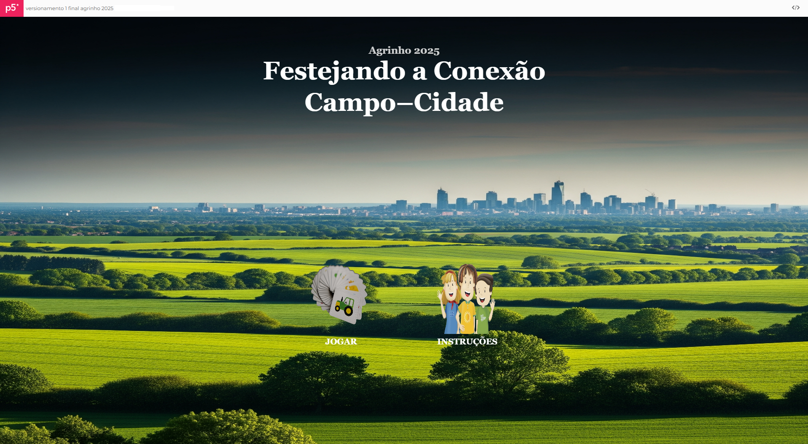

# 🌾 Projeto Agrinho 2025 - **"Festejando Conexão Campo e Cidade"** 🏙️

## ▶️ Deploy / Como Executar o Projeto
 *   [GitHub Pages](link)
 *   [Vercel](link)
 *   [p5.js Editor - Tela Cheia](link)
 *   É recomendado que o projeto seja acessado atraves do deploy para evitar sobreposicões de elementos. caso projeto seja aberto pelo p5.js recomenda-se que abra em tela cheia.

---

## 🎯 Sobre o Projeto

Este projeto foi desenvolvido para o **Concurso Agrinho 2025** com o objetivo de criar uma experiência interativa que ilustra a profunda e vital conexão entre o campo e a cidade. Através de elementos gráficos e interatividade, mostramos como esses dois ambientes se complementam, ressaltando a importância mútua para o desenvolvimento sustentável.

🖥️ Construído em **JavaScript** utilizando a biblioteca **p5.js**, o projeto apresenta uma tela dinâmica com representações visuais da vida rural e urbana.

---

## ✨ Pontos de Destaque

- **Jogo da Memória Temático**  
  Cada par encontrado revela uma conexão essencial entre campo e cidade, como "Alimento", "Água", "Energia", entre outros.

- **Transições Suaves**  
  Navegação fluida entre telas de introdução, instruções, jogo e finalização, proporcionando uma jornada agradável para o usuário.

- **Efeitos Visuais Interativos**  
  - *Títulos animados* com efeito de fade-in gradual para um toque profissional.  
  - *Botões dinâmicos* que reagem ao mouse com efeitos visuais de "foguinhos" coloridos.  
  - *Fogos de artifício* aparecem ao encontrar pares, reforçando a sensação de conquista.
  -  *Sons* recursos sonoros durante o jogo e ativados com o clique

- **Mensagem Final Impactante**  
  Ao concluir o jogo, uma mensagem reflexiva reforça a importância da interdependência entre campo e cidade.

- **Carregamento Dinâmico de Imagens**  
  Utilização de template strings para carregar imagens das cartas, facilitando futuras expansões do jogo.

---

## 🚀 Recursos Utilizados

### Linguagem de Programação
- **JavaScript:** A base de toda a lógica e interatividade do jogo.

### Biblioteca
- **p5.js:** Essencial para a criação gráfica, animações, manipulação de áudio e eventos do usuário.

### Ambiente de Desenvolvimento
- **p5.js Web Editor:** Ambiente online para codificação e prototipagem rápida.
- **GitHub:** Utilizado para versionamento e hospedagem do código-fonte.

### Funções e Conceitos do p5.js

#### Estrutura Básica
- `setup()`
- `draw()`
- `preload()`

#### Desenho e Gráficos
- `createCanvas()`
- `rect()`
- `circle()`
- `image()`
- `text()`
- `fill()`
- `stroke()`
- Manipulação de cores

#### Interatividade e Eventos
- `mousePressed()`
- `dist()`

#### Animação e Matemática
- `map()`
- `lerp()`
- `random()`
- `constrain()`
- `shuffle()`

#### Vetores
- `createVector()`
- `p5.Vector` (para movimento e física das partículas)

#### Mídia (Imagens e Sons)
- `loadImage()`
- `loadSound()`

#### Controle de Áudio
- `.play()`
- `.setVolume()`
- `.loop()`
- `.pause()`
- `.stop()`

#### Manipulação de Tempo
- `millis()` para controle de animações e transições
- `setTimeout()` para atrasar ações no jogo (como a verificação de pares de cartas)

#### Programação Orientada a Objetos (POO)
- Uso de **classes** (`Carta`, `BotaoRedondo`, `Foguinho`) para modelar os elementos do jogo, encapsulando propriedades e comportamentos e promovendo a reutilização de código.

---
## 📚 Links usados para consulta e aprofundamento:

Para o desenvolimento do projeto e consulta de recursos foi utilizado:

* **p5.js - Documentação Oficial:**
    * [https://p5js.org/reference/](https://p5js.org/reference/)

* **Mozilla Developer Network (MDN) - JavaScript:**
    * [https://developer.mozilla.org/pt-BR/docs/Web/JavaScript](https://developer.mozilla.org/pt-BR/docs/Web/JavaScript)

---

🎵 **Atribuição de Imagens e Sons**  
Durante o desenvolvimento deste projeto, foram utilizados recursos visuais e sonoros de fontes livres, seguindo as melhores práticas de atribuição.

---

🖼️ **Imagens:**

Como o Markdown ignora target="_blank", use clique com a scroll do mouse para acessar os links em nova guia.

| Nome/Descrição    | Fonte / Autor                                      | Licença               |
|-------------------|---------------------------------------------------|-----------------------|
| trigo-campo-campo-de-trigo-cevada      | [Pixabay](https://pixabay.com/pt/photos/trigo-campo-campo-de-trigo-cevada-2549245/)                   | Gratuita              |
| pão-cozido-comida-fresquinhos      | [Pixabay](https://pixabay.com/pt/photos/p%C3%A3o-cozido-comida-fresquinhos-1281053/)                   | Gratuita              |
| vaca-vaca-normal-vaca-de-leite       | [Pixabay](https://pixabay.com/pt/photos/vaca-vaca-normal-vaca-de-leite-7957275/)                   | Gratuita              |
| vaca-leite-vaca-de-leite-branco       | [Pixabay](https://pixabay.com/pt/photos/vaca-leite-vaca-de-leite-branco-4909684/)                   | Gratuita              |
| rio-outono-arvores-folhas-folhagem       | [Pixabay](https://pixabay.com/pt/photos/rio-outono-arvores-folhas-folhagem-219972/)                   | Gratuita              |
| agua-gotas-respingo       | [Pixabay](https://pixabay.com/pt/photos/agua-gotas-respingo-got%C3%ADcula-4967843/)                   | Gratuita              |
| madeira-pilha-troncos-de-árvore       | [Pixabay](https://pixabay.com/pt/photos/madeira-pilha-troncos-de-%C3%A1rvore-1868104/)                   | Gratuita              |
| carpinteiro-avião-aparas-de-madeira       | [Pixabay](https://pixabay.com/pt/photos/carpinteiro-avi%C3%A3o-aparas-de-madeira-4015109/)                   | Gratuita              |
| grãos-de-café-café-cafeína       | [Pixabay](https://pixabay.com/pt/photos/gr%C3%A3os-de-caf%C3%A9-caf%C3%A9-cafe%C3%ADna-7126154/)                   | Gratuita              |
| café-café-moído-cafeteria       | [Pixabay](https://pixabay.com/pt/photos/caf%C3%A9-caf%C3%A9-mo%C3%ADdo-cafeteria-206142/)                   | Gratuita              |
| energia-fluxo-agua       | [Pixabay](https://pixabay.com/pt/photos/energia-fluxo-agua-2976738/)                   | Gratuita              |
| luminária-luz-mão-idéia-lâmpada       | [Pixabay](https://pixabay.com/pt/photos/lumin%C3%A1ria-luz-m%C3%A3o-id%C3%A9ia-l%C3%A2mpada-2663053/)                   | Gratuita              |
| agricultor-agricultura-campos      | [Pixabay](https://pixabay.com/pt/photos/agricultor-agricultura-campos-8294716/)                   | Gratuita              |
| Feira cidade       | [Google](https://images.app.goo.gl/e4cUGnKpVvGXcYWL9)                   | creative commons - Ramiro Furquim             |
| abelhas-apicultura-apiário-colmeias       | [Pixabay](https://pixabay.com/pt/photos/abelhas-apicultura-api%C3%A1rio-colmeias-7170198/)                   | Gratuita              |
| querida-amarelo-apicultor-natureza       | [Pixabay](https://pixabay.com/pt/photos/querida-amarelo-apicultor-natureza-1958464/)                   | Gratuita              |
| zangão-vôo-câmera-controle-remoto       | [Pixabay](https://pixabay.com/pt/photos/zang%C3%A3o-v%C3%B4o-c%C3%A2mera-controle-remoto-1866742/)                   | Gratuita              |
| Uma pessoa trabalhando em um equipamento em uma mesa       | [Unsplash](https://unsplash.com/pt-br/fotografias/uma-pessoa-trabalhando-em-um-equipamento-em-uma-mesa-3PJNIvkf-Tw)                   | Gratuita              |
| a-criação-de-galinhas-poedeira       | [Pixabay](https://pixabay.com/pt/photos/a-cria%C3%A7%C3%A3o-de-galinhas-poedeiras-4133960/)                   | Gratuita              |
| ovo-frito-frigideira-refeição-grade       | [Pixabay](https://pixabay.com/pt/photos/ovo-frito-frigideira-refei%C3%A7%C3%A3o-grade-3238173/)                   | Gratuita              |
| imagem tela inicial - Gerado por IA - prompt: gostaria que gerrase uma imagem de fundo para meu projeto, com o tema festejando conexao campo cidade, precisa ter campo, cidade, ser uma imagem realista e que fique um contraste bom com as cores da tela inicial | [Gemini](https://gemini.google.com/?hl=pt-BR)                  | Imagem gerada por Gemini|

---

🎶 **Sons:**

| Nome/Descrição    | Fonte / Autor                                      | Licença               |
|-------------------|---------------------------------------------------|-----------------------|
| EDM Loop   | [Pixabay](https://pixabay.com/pt/sound-effects/edm-loop-319038/)               | gratuita      |
| Winning Loop   | [Pixabay](https://pixabay.com/pt/sound-effects/winning-loop-228639/)               | gratuita      |
| Traffic in City   | [Pixabay](https://pixabay.com/pt/sound-effects/traffic-in-city-309236/)               | gratuita      |
| Passarinho   | [Pixabay](https://pixabay.com/pt/sound-effects/passarinho-325866/)               | gratuita      |

---

